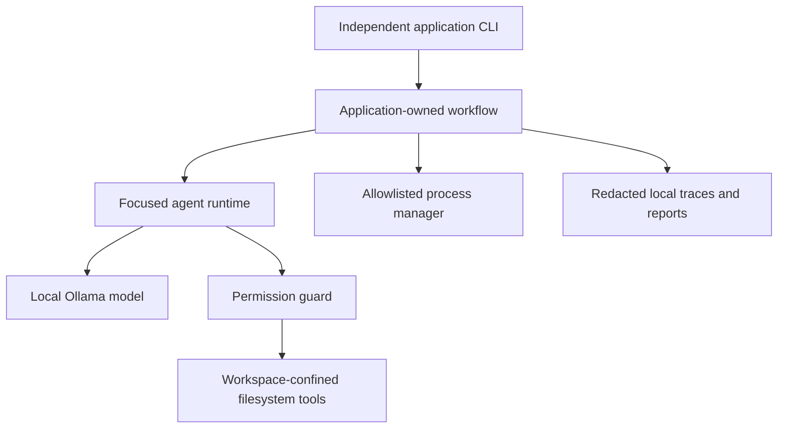

# Architecture

Applications own policy, orchestration, commands, pass/fail, locks, and reports. Agents are role configurations sharing a provider-neutral runtime. Tools are deterministic TypeScript capabilities. The model reasons over supplied evidence and can only request registered actions.

Before each agent starts, the runtime verifies that every permitted tool is registered and generates one exact action contract from the active tool set and role-specific final-result schema. The contract names every allowed action and property, documents mutation semantics, and forbids aliases, wrappers, commentary, and multiple objects. Ollama JSON mode constrains the response envelope; strict Zod discriminated unions remain authoritative for action fields and final results. A malformed response receives bounded schema-specific correction feedback. One isolated JSON Markdown fence is accepted defensively, but surrounding commentary, multiple fences, trailing objects, unknown properties, and wrong field names are rejected.
