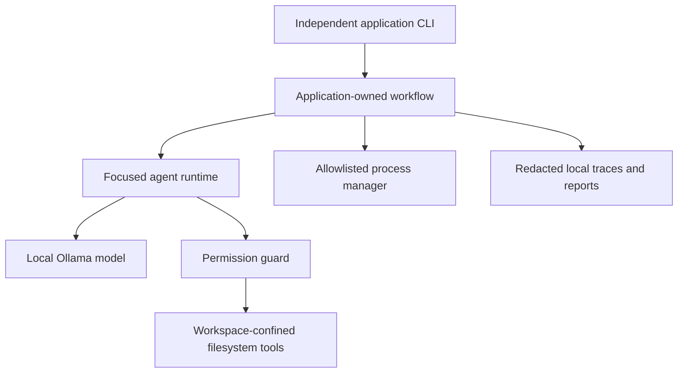

# Architecture

Applications own policy, orchestration, commands, pass/fail, locks, and reports. Agents are role configurations sharing a provider-neutral runtime. Tools are deterministic TypeScript capabilities. The model reasons over supplied evidence and can only request registered actions.
